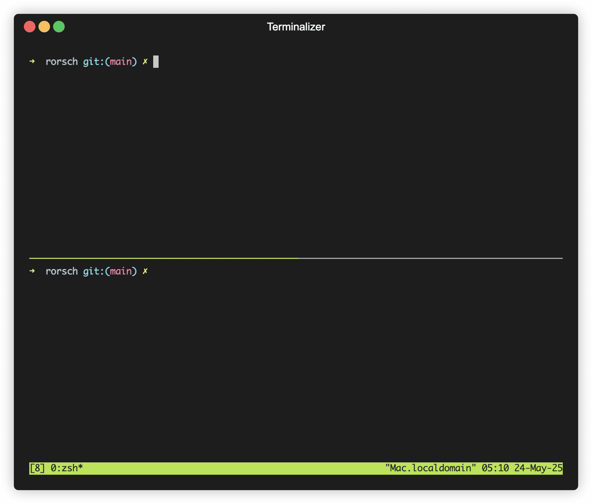

# 🧠 Rorsch

**Rorsch** is a terminal-based file watcher and command executor built with [Bubble Tea](https://github.com/charmbracelet/bubbletea). It watches for file changes using globs, runs commands like `go test` or `go run`, and gives you a beautiful, interactive UI to track output, status, and logs in real time.

> It’s like `entr`, `watchexec`, or `nodemon`, but with a brain 🧠 and a soul.



---

## ✨ Features

- 🔄 Watch any file pattern using `**/*.{ext}` globs
- 🚦 See command status live: ✅ pass, ❌ fail, ⏳ running
- 📜 View streaming output per command
- 🧵 Written in Go with a responsive TUI using Bubble Tea
- ⚙️ Easy configuration via YAML
- 💻 Works great for Go projects (but supports any shell command)

---

## 🏁 Getting Started

### ✅ Install

```
brew tap heldtogether/tools
brew install rorsch
```

Or clone and build:

```
git clone https://github.com/heldtogether/rorsch
cd rorsch
go build -o rorsch ./cmd/rorsch
```

Or download from https://github.com/heldtogether/rorsch/releases/. 

---

### ▶️ Run it

```
./rorsch
```

By default it will look for a file called `rorsch.yml` in the current directory.

You can also pass a config file explicitly:

```
./rorsch -c watcher.yml
```

---

## ⚙️ Configuration

Use a YAML file (default: `rorsch.yml`) to define your commands and file globs:

```yaml
commands:
  - name: Tests
    exec: go test -count=1 ./...
    glob: "**/*.go"
    cwd: ./your/go/project

  - name: Server
    exec: go run ./main.go
    glob: "**/*.go"
    cwd: ./your/go/project
```

### Fields:

| Field   | Description                          |
|---------|--------------------------------------|
| `name`  | Display name in the UI               |
| `exec`  | Shell command to run on file change  |
| `glob`  | Files to watch (supports `**`)       |
| `cwd`   | Directory to run the command in      |

---

## 🖥 UI Controls

- `↑ / ↓` – move between commands
- `q` – quit
- Auto-refreshes on file change
- Spinner indicates running state

---

## 🧪 Example Use Case

You're writing a Go API and want to:

- Rerun tests on any `.go` file change
- Restart the server if anything changes
- Do all of this in a single TUI

Just drop this in `rorsch.yml` and go 🚀

---

## 🤝 Contributing

### 🛠 Setup for development

```
git clone https://github.com/heldtogether/rorsch
cd rorsch
go mod tidy
go run ./cmd/rorsch
```

### ✅ Run tests

```
go test ./...
```

### 🧪 Write new watchers or test helpers?

We use interfaces for filesystem, debounce, and exec to make testing simple. See `internal/watcher` or `internal/execer` for examples.

Pull requests welcome. Please:
- Keep changes minimal and clean
- Include tests if possible
- Write human-readable commit messages

---

## 🧼 Roadmap / Ideas

- [ ] Hot reload YAML config
- [ ] Pause / resume individual commands
- [ ] Live search logs
- [ ] Watch remote file systems

---

## 📜 License

[MIT](LICENSE)

---

Built with 💙 by [@heldtogether](https://github.com/heldtogether)

